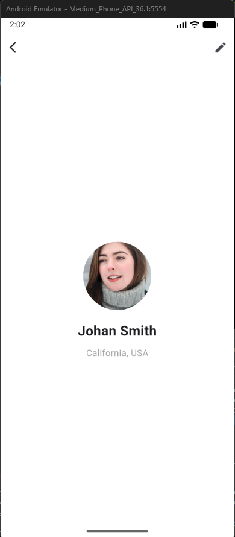

# Bài Tập Tuần 1 – Lập Trình Di Động

## 1. Mục tiêu bài tập

- Hiểu định hướng học tập và mục tiêu sau môn học.
- Nhận định về tương lai ngành lập trình di động trong 5–10 năm tới.
- Tạo một ứng dụng Flutter đơn giản mô phỏng UI theo yêu cầu.
- Làm quen với cách tạo project Flutter, cấu trúc thư mục và viết giao diện.
- Đẩy toàn bộ bài tập lên GitHub theo yêu cầu môn học.

---

## 2. Nội dung bài tập

### **Câu 1: Mong muốn và định hướng sau khi học xong môn**

> Sau khi học xong môn lập trình di động, em mong muốn có thể:
>
> - Nắm vững các kiến thức nền tảng về phát triển ứng dụng di động.
> - Tự xây dựng được ứng dụng mobile cơ bản từ UI đến xử lý logic.
> - Định hướng trở thành lập trình viên Mobile (Android/iOS hoặc Flutter).
> - Có thể tiếp tục học thêm về API, backend và kiến trúc để làm ứng dụng hoàn chỉnh.
>   → Vì vậy đề tài lần này của nhóm em chính là dự án mà em đã ấp ủ để làm và phát triển khi ra trường, mục đích hướng tới là có thể bán được cho các công ty.

### **Câu 2: Tương lai 10 năm tới lập trình di động có phát triển không?**

> Có. Lập trình di động chắc chắn tiếp tục phát triển mạnh vì:
>
> - Số lượng người dùng smartphone ngày càng tăng.
> - Ứng dụng mobile được dùng trong mọi lĩnh vực: mua sắm, học tập, thanh toán, giải trí.
> - Công nghệ mới như AI, IoT, AR/VR tích hợp ngày càng nhiều vào mobile.
> - Doanh nghiệp cần app mobile để tiếp cận khách hàng.  
>   → Nhu cầu nhân lực mobile vẫn rất lớn trong tương lai.

### **Câu 3: Viết ứng dụng Flutter theo UI yêu cầu**

Ứng dụng gồm các thành phần:

- AppBar có nút Back và nút Edit
- Avatar hình tròn
- Tên người dùng
- Địa điểm
- Giao diện tối giản, hiện đại giống mẫu minh họa

---

## 3. Giải thích các hàm chính trong code

### Hàm `main()`

```dart
void main() {
  runApp(const ProfileApp());
}
```

- Hàm khởi động ứng dụng Flutter.
- `runApp()` chạy widget gốc là `ProfileApp`.

---

### Widget `ProfileApp`

```dart
class ProfileApp extends StatelessWidget {
  @override
  Widget build(BuildContext context) {
    return MaterialApp(
      debugShowCheckedModeBanner: false,
      home: const ProfileScreen(),
    );
  }
}
```

- Là widget gốc của ứng dụng.
- Trả về `MaterialApp`.
- Tắt banner DEBUG và đặt màn hình chính là `ProfileScreen`.

---

### Widget `ProfileScreen`

```dart
class ProfileScreen extends StatelessWidget { ... }
```

- Màn hình chính của ứng dụng.
- Dùng `Scaffold` để tạo cấu trúc gồm AppBar và nội dung.

---

### AppBar

```dart
appBar: AppBar(
  backgroundColor: Colors.white,
  elevation: 0,
  leading: IconButton(icon: Icon(Icons.arrow_back_ios)),
  actions: [IconButton(icon: Icon(Icons.edit))],
),
```

- `leading`: nút quay lại.
- `actions`: nút chỉnh sửa.
- AppBar màu trắng, không có bóng.

---

### Body (Nội dung chính)

```dart
body: Center(
  child: Column(
    mainAxisAlignment: MainAxisAlignment.center,
    children: [ ... ],
  ),
),
```

- `Center`: căn giữa toàn bộ nội dung.
- `Column`: sắp xếp widget theo chiều dọc.

---

### Avatar người dùng

```dart
CircleAvatar(
  radius: 60,
  backgroundImage: NetworkImage("https://i.pravatar.cc/300"),
),
```

- Hiển thị ảnh đại diện dạng hình tròn.
- Ảnh tải từ Internet bằng `NetworkImage`.

---

### Text hiển thị tên & địa chỉ

```dart
Text("Johan Smith")
Text("California, USA")
```

- Hiển thị tên người dùng và địa điểm.
- Tên in đậm, địa chỉ màu xám.

## Kết quả chạy ứng dụng


