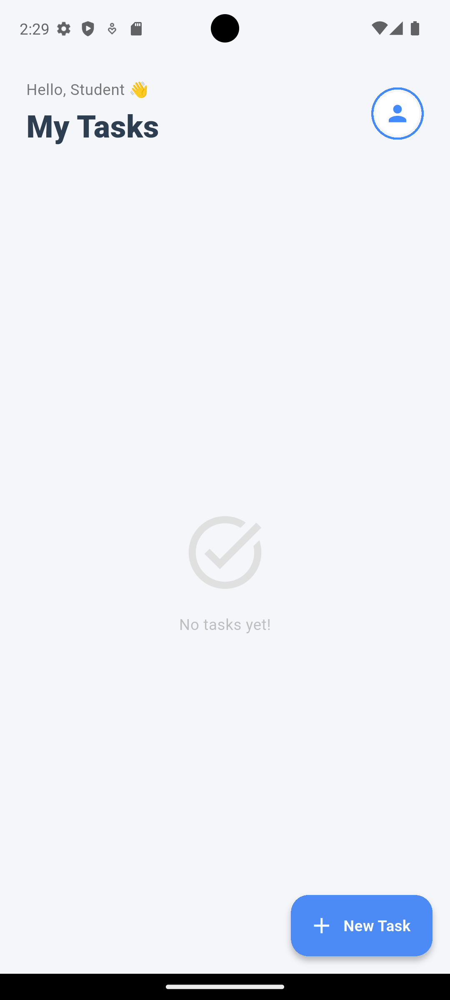
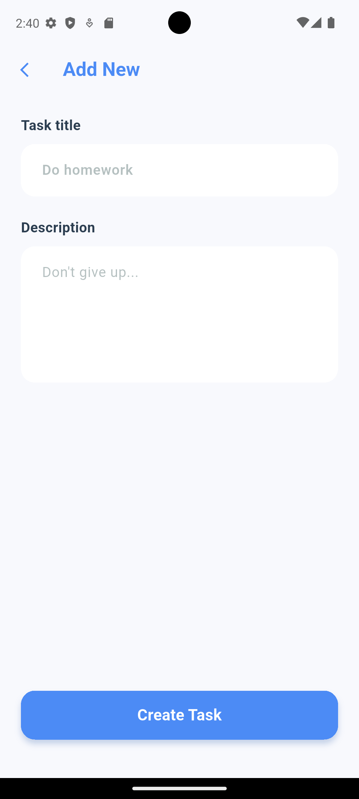
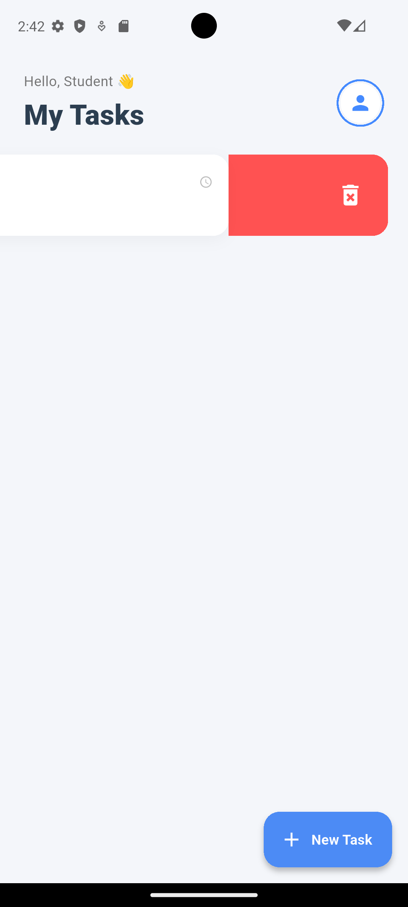

## Mục tiêu & Yêu cầu (Objectives)

- **Kiến trúc:** Triển khai theo mô hình **MVVM** (Model - View - ViewModel) để tách biệt logic và giao diện.
- **Lưu trữ:** Sử dụng **Sqflite** (tương đương Room trên Android) để lưu trữ dữ liệu cục bộ, đảm bảo ứng dụng hoạt động khi không có mạng.
- **Giao diện:** Thiết kế giao diện hiện đại, hỗ trợ thao tác vuốt để xóa (Swipe-to-delete).
- **Trạng thái:** Sử dụng **Provider** để quản lý trạng thái, cập nhật giao diện tức thì khi dữ liệu thay đổi.

## Công nghệ sử dụng (Tech Stack)

- **Ngôn ngữ:** Dart
- **Framework:** Flutter
- **State Management:** Provider
- **Local Database:** Sqflite, Path
- **UI/UX:** Material Design 3, Custom Cards

## Cấu trúc dự án (Project Structure)

Dự án tuân thủ chặt chẽ kiến trúc MVVM:

- `lib/models/`: Chứa `Task` model (định nghĩa dữ liệu).
- `lib/data/`: Chứa `DatabaseHelper` (xử lý trực tiếp với SQLite).
- `lib/viewmodels/`: Chứa `TaskViewModel` (cầu nối logic giữa View và Data).
- `lib/views/`: Chứa các màn hình (`HomeScreen`, `AddTaskScreen`).

## Giải thích các hàm chính (Key Functions)

### DatabaseHelper (`data/database_helper.dart`)

- `_initDatabase()`: Khởi tạo file database `uth_smart_tasks.db` và tạo bảng `tasks` nếu chưa tồn tại.
- `insertTask(Task task)`: Chuyển đổi object Task thành Map và lưu vào bảng.
- `getTasks()`: Truy vấn toàn bộ danh sách công việc, sắp xếp theo ID giảm dần (mới nhất lên đầu).
- `deleteTask(int id)`: Xóa công việc khỏi database dựa trên ID.

### TaskViewModel (`viewmodels/task_view_model.dart`)

- `loadTasks()`: Gọi Database lấy dữ liệu và dùng `notifyListeners()` để báo UI cập nhật.
- `addTask(...)`: Thêm task mới vào DB, sau đó reload lại danh sách để hiển thị ngay lập tức.
- `deleteTask(int id)`: Xóa task khỏi danh sách hiển thị trước (để UI mượt mà), sau đó xóa ngầm trong Database.

## 6. Kết quả đạt được (Output)

### Màn hình chính (Home Screen)

Giao diện danh sách công việc với thiết kế thẻ (Card) hiện đại, hiển thị tiêu đề và mô tả ngắn gọn.

### Thêm công việc (Add Task)

Giao diện nhập liệu với validation đơn giản.

### Tính năng Vuốt để xóa (Swipe to Delete)

Người dùng vuốt sang trái để xóa công việc.

